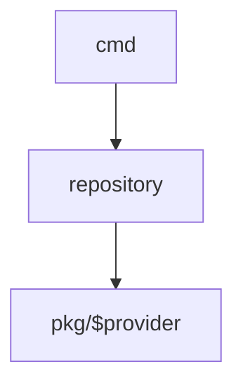

# Design

## CMD

Every command reaches a provider through the same `IRepository`, so a verb
means the same thing everywhere — only the store behind it changes. The cells
below name what each verb does against each provider's store.

`local` is the default provider and its verbs are top-level (`profiler add`,
`profiler show`, …). The remote providers namespace the same verbs under the
provider name (`profiler ssm add`, `profiler consul show`, …); `use` also
accepts the remote form `profiler use <provider> <name>`.

| command  | local                                         | consul                                | ssm                                   | vault                                  |
|----------|-----------------------------------------------|---------------------------------------|---------------------------------------|----------------------------------------|
| `list`   | names of the profile files in `profilesFolder`| keys under `consulProfilesPath`       | profiles under the SSM parameter path | secrets under `vaultProfilesPath`      |
| `show`   | variable names in the profile file            | variable names in the KV entry        | variable names of the SSM parameters  | variable names in the Vault secret     |
| `use`    | export the file's vars into a new shell       | export the KV entry's vars            | export the SSM parameters             | export the Vault secret's vars         |
| `add`    | append a profile / var to the file            | write a profile / var to the KV       | put a profile / var as SSM parameters | write a profile / var to the Vault secret |
| `remove` | delete the file, or drop one var from it      | delete the KV entry, or drop one var  | delete the parameters, or drop one    | delete the Vault secret, or drop one var |

Each cell is the same `IRepository` method — `List`, `Show`, `Get`, `Add`,
`Remove` — implemented once per provider under `pkg/$provider`. All four
providers implement all of them; none is stubbed.

`use` stacks: run against a profile that is already in use, it exports both
profiles' variables and the newer one wins on a key they share. See the
decision below.

Three commands sit outside the matrix, because they do not address a single
profile store:

- `profiler` with no argument (and `profiler use` with no name) sources the
  local env files — `.profiler`, then any `*.env`, then `.env.yml`, then
  `.envrc` — with no named profile.
- `profiler status` prints the profile currently in use, read from the
  `profile_name` environment variable — the whole stack, `A+B`, when profiles
  are stacked. It asks no provider.
- `profiler aws_mfa <token>` overrides the active AWS credentials with ones
  obtained via an MFA challenge; it needs an already-active AWS profile.

## Decisions

### The Profile type lives in `pkg/profile` (2026-08-26)

The redesign briefly carried two `Profile` types: `pkg/profile` and a new
top-level `profile/`. **`pkg/profile` is the one that stays**; `profile/` has
been deleted.

They were not two spellings of the same idea — they were two different answers
to "where does the behaviour of acting on a profile live":

- `profile/` declared `IProfile` with `Add`, `Remove`, `Show`, `Use` and
  `GetDotProfiler`, i.e. a profile that acts on itself. For that to work, a
  `Profile` has to know which provider it came from and how to talk to it.
- `pkg/profile` keeps `Profile` a plain data type (`Name` plus `[]KV`) and puts
  the verbs on `IRepository`, one implementation per provider. The provider
  holds the transport; the profile is just the value that crosses the boundary.

The repository-centric answer is the one the branch actually built: `IRepository`
and all four providers use `pkg/profile`, and the `cmd -> repository ->
pkg/$provider` shape above depends on `Profile` being transport-agnostic. A
profile that carried its own provider would put a Consul client and an SSM
client behind the same struct and undo that split.

`profile/` was also unfinished rather than merely unused: every `IProfile` method
was commented out, `New()` returned a zero value, and its two Kubernetes helpers
were byte-identical copies of `pkg/profile/kubernetes.go`. Nothing imported it,
so there was nothing to migrate.

Keeping the package under `pkg/` also keeps it beside its siblings — `pkg/local`,
`pkg/consul`, `pkg/ssm`, `pkg/vault`.

Consequence worth knowing: adding a provider means implementing `IRepository`,
never adding methods to `Profile`. If a future feature genuinely needs a profile
to act on itself, that is a decision to reopen here, not to solve by
reintroducing a second type. Profile stacking was the candidate for it, and did
not need it: composition is a function over `[]Profile`, see the decision
below.

### `use` stacks, it does not replace (2026-08-27)

**`profiler use B`, run while profile `A` is in use, layers B over A.** Both
profiles' variables are exported at once; on a key both carry, B wins. That is
the meaning of `use`, not an option on it — there is no flag and no config key
to turn it off.

`pkg/profile` used to carry three functions towards this, all removed as dead
code: `inUseProfileName()`, `requireComposition()`, and a `ComposeProfile` that
returned an empty `Profile` and no error. They are now written for real, as
`ComposeProfile`, `ActiveProfile` and `StackEnvironment` in
`pkg/profile/compose.go`.

**Precedence: the newly applied profile wins.** It matches the layering
`pkg/local` already does *within* one profile — the profile file, then any
`*.env`, then `.env.yml`, then `.envrc`, each overriding the last — so "later
wins" means the same thing within a profile and across profiles.

**Unstacking is a false problem.** `SetEnvironment` ends in `syscall.Exec`, so
every `use` lands in a *new* shell whose environment is the composed one.
Leaving that shell leaves the stack with it: `exit` is `unuse`. Nothing needs
writing for it, and nothing should be — an explicit `profiler unuse` would have
to unpick variables from a shell it does not own.

**Composition is a function over `[]profile.Profile`**, per the decision above,
not a method on `Profile`. `ComposeProfile` knows nothing about where its
inputs came from, so stacking a local profile over an SSM one costs nothing
extra, and `ActiveProfile` recovers the profile in use without knowing which
provider it came from either.

#### Recovering the profile in use

The values were never the hard part. Because `use` execs, the shell it lands in
inherits everything the previous profile exported — `A`'s variables survive
`use B` whether profiler intends it or not. What was missing is *knowing which
ones they are*: a process environment holds hundreds of variables and says
nothing about which came from a profile.

So `SetEnvironment` exports one variable of its own beside the profile's:

- `profile_keys` — every key the profile in use owns, comma separated.

`ActiveProfile` reads it back and rebuilds the profile from the environment. A
key listed there but since removed from the environment is dropped rather than
rebuilt empty, so `unset FOO` genuinely takes `FOO` out of the profile instead
of stacking an empty value onto the next one.

Two things follow from the stack being explicit rather than accidental:

- **`.profiler` is a faithful record again.** It is truncated and rewritten on
  every `use`; before, it held only the profile applied last while the
  environment held the union. Now it holds the union — which is what
  `preserveProfile: true` keeps around, and what bare `profiler` sources back.
- **`profiler status` reports the whole stack.** `profile_name` becomes `A+B`,
  built by `ComposeProfile` from the names of every profile in it. A name is
  split on `+` before being joined, so `use A` inside `A+B` stays `A+B` rather
  than growing on every invocation.

`ComposeProfile` takes a profile's name from its `profile_name` variable in
preference to its `Name` field. They agree for local, SSM and Vault profiles;
for Consul they do not, because `Name` there is the full KV path
(`profiler/staging`) while `profile_name` is the profile's own name
(`staging`). `profile_name` is the marker every profile sets, so it wins.

#### What does not stack

`profiler aws_mfa` keeps calling `SetEnvironment` directly. It does not add a
profile — it re-issues the credentials of the profile already in use, under the
name `<profile>-MFA` — so joining the stack would name it `A+A-MFA`. It
replaces, as it always has.
