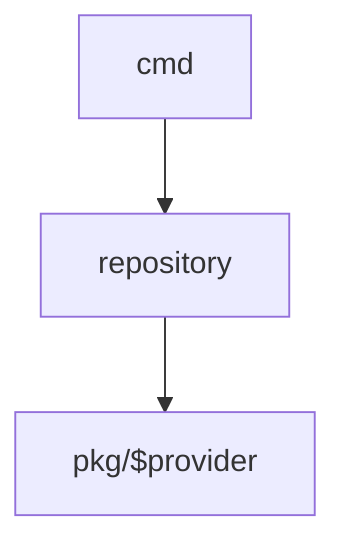

# Design

## CMD

| command/repository | local              | consul           |ssm                             |
|--------------------|--------------------|------------------|--------------------------------|
| list               | get keys from file | get keys from KV | get keys from parameter's path |

